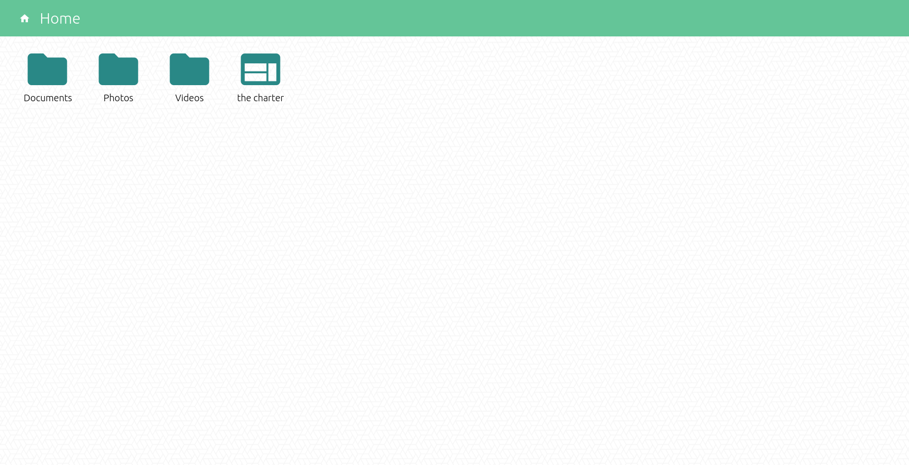

# Emerson's Computer v3



## Overview

Emerson's computer serves narrative content through a fake file browser running in a Google Chrome kiosk window. You can browse through the photos and notes from the original computer, as well as view Emerson's video logs and family photos. thecharter.org, which contains a vast amount of narrative content, is also accessible in an iframe on the site.

Toast notifications from the Charter pop up somewhat randomly to tease the user. Also,you can draw on the background by clicking and dragging!

## Important!!! Special Keyboard

The kiosk has a special keyboard plugged into it with electrical tape over the special keys (ctrl, cmd, alt, etc.) so the user is forced to stay in the kiosk. If you need to modify things on the machine, use a different keyboard and press alt+f4 to close the kiosk. Do not leave other keyboards at the computer unless they are similarly modified!

## Running

The kiosk will start automatically when the computer starts up. If you need to run it manually:

Open a terminal and enter the following to change to the kiosk directory and start the server.

```
cd ~/Desktop/emerson-kiosk
python -m SimpleHTTPServer 8001
```

Then open Google Chrome in kiosk mode with password storing set to basic.
```
google-chrome --kiosk --password-store=basic http://localhost:8001
```

## Installation

The Emerson kiosk should work on any OS that can run Google Chrome in kiosk mode.

Some of these instructions are specific to Ubuntu/Linux. If you need help installing on a different OS, contact Slaton.

1. Install google chrome from https://www.google.com/chrome/
2. Install python from https://www.python.org/downloads/
3. Install the [Redirector](https://chrome.google.com/webstore/detail/redirector/ocgpenflpmgnfapjedencafcfakcekcd?hl=en) Chrome extension and add the following redirects TODO: Images of redirects
4. Download this repository and copy the "emerson-pc" directory to the Desktop.
5. Add "start-kiosk.sh" to the crontab.

  ```
  crontab -e
  ```
  Add this line to the bottom of the file.

  ```
  @reboot ~/Desktop/emerson-kiosk/start-kiosk.sh
  ```
6. Open "Startup Applications" and add the following command.

```
google-chrome --kiosk --password-store=basic http://localhost:8001
```

7. Follow the HERbe instructions for installing the watchdog.
8. Enable Wake-on-LAN in the BIOS.

### Video Logs and Family Photos

Since the family photos and video logs are so large, they are not included here. Download them [here](https://drive.google.com/drive/folders/1fc-vyryyW78sm_dgjffAaPKvvyP2SNIm?usp=sharing).

You must be logged into Drive with a Meow Wolf email!) and put them in the images/family and video directories respectively.

### divgen.py

This python script is used to generate the divs for the "family.html" page. You shouldn't need to run it unless you add more photos to the family photo directory (and even then you could probably do it by hand). The filenames are enumerated from 0001 to 000x where x is the number of photos. Make sure you run it in the directory containing the photos!
